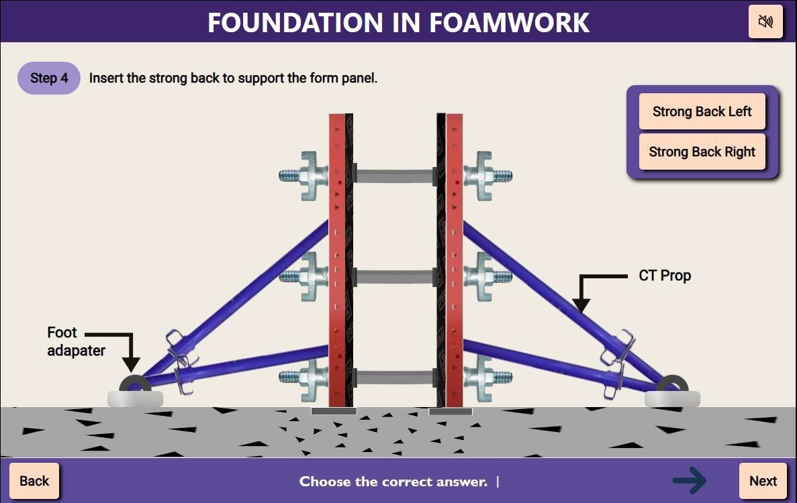

### Procedure

 
I.  Step 1: Prepare the Foundation Base- Ensure the foundation surface is level and free of debris. Mark out the foundation dimensions according to the construction plan. 

II. Step 2: Position the Sheathing Panels- Place the sheathing panels along the marked foundation lines, ensuring they are aligned and at the correct height. 

III.  Step 3: Install the Tie Rods and Spacers- Insert the tie rods through the sheathing panels at regular intervals, securing them with spacers to maintain the desired wall thickness. 

IV. Step 4: Attach the Side Yokes and End Yokes- Fix the side yokes and end yokes at the panel edges to clamp the sheathing panels together, ensuring they are secured. 

V.  Step 5: Insert Wedges and Tighten Bolts- Use wedges to adjust and tighten the yokes, ensuring that all panels are firmly connected. Secure the assembly with bolts and lock nuts, tightening them to ensure stability. 

VI. Step 6: Install Strong back- Strong back arrangement is used to support the form panel on either side. Foot adapters are used to adjust the angle of the CT props. 

VII.  Step 7: Check Alignment and Stability- Verify that the formwork is correctly aligned, level, and stable. Adjust if necessary to meet the project specifications. 

VIII. Step 8: Final Inspection- Conduct a final inspection to ensure all components, such as washers and lock nuts, are correctly installed and the formwork is ready for concrete pouring. 

 
   

 
For the PERI Foundation formwork system, several critical requirements must be met to ensure the quality, safety, and cost-effectiveness of the concrete structure. The formwork must be robust enough to withstand the weight of the concrete and any associated construction activities. It must also be precisely constructed to ensure that the concrete structure takes on the correct shape and dimensions. Additionally, the formwork should be designed for reusability to help reduce overall costs.
An effective formwork design must account for factors such as the type of foundation, the load-bearing capacity, and the specific environmental conditions. Successful formwork construction relies on clear communication and coordination among the construction team, including engineers, contractors, and workers.

#### Procedure Summary: 
I.  Mark the Foundation Area: Mark the foundation dimensions on the site as per plan. 
II. Position Sheathing Panels: Place and align sheathing panels along the marked lines. 
III.  Install Tie Rods and Spacers: Insert tie rods & spacers to maintain correct wall thickness. 
IV. Attach Side and End Yokes: Secure panels with side and end yokes at designated points. 
V.  Secure with Wedges and Bolts: Tighten the formwork using wedges, bolts, and lock nuts. 
VI. Provide Vertical Support: Attach vertical supports to stabilize the formwork structure. 
VII.  Inspect and Adjust: Ensure alignment and stability with a final inspection before concrete pouring. 

#### Conclusion: 
In conclusion, setting up the PERI Foundation formwork system requires careful attention to detail, precision in positioning components, and secure fastening to ensure the stability and accuracy of the concrete structure. By following a systematic procedure that includes marking, positioning, securing, and inspecting the formwork, construction teams can achieve a high-quality foundation that meets structural requirements and optimizes both safety and cost-effectiveness. Proper execution and thorough inspection at each step are essential for the successful completion of the project.
